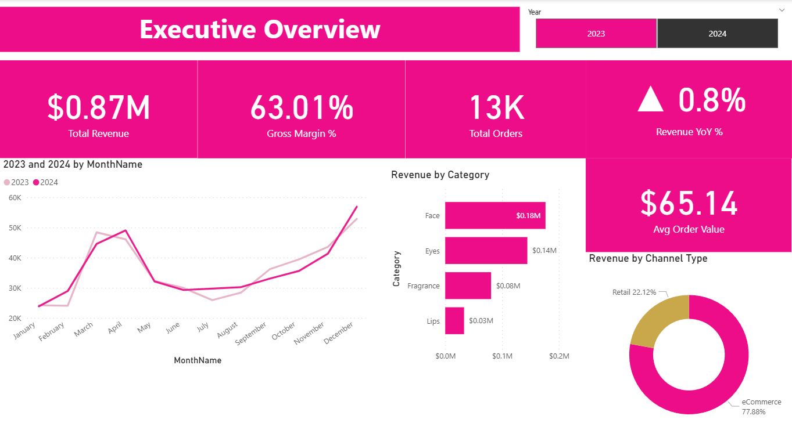
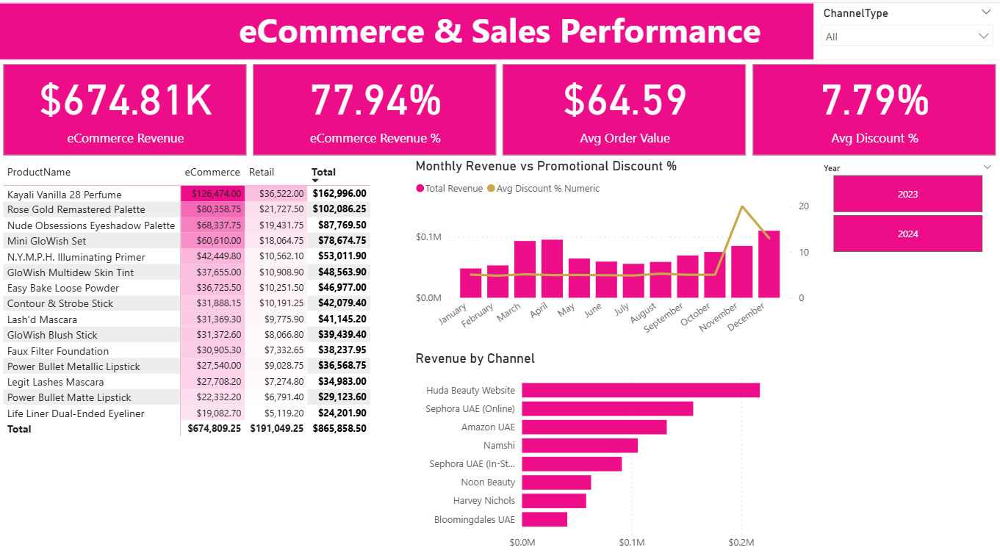
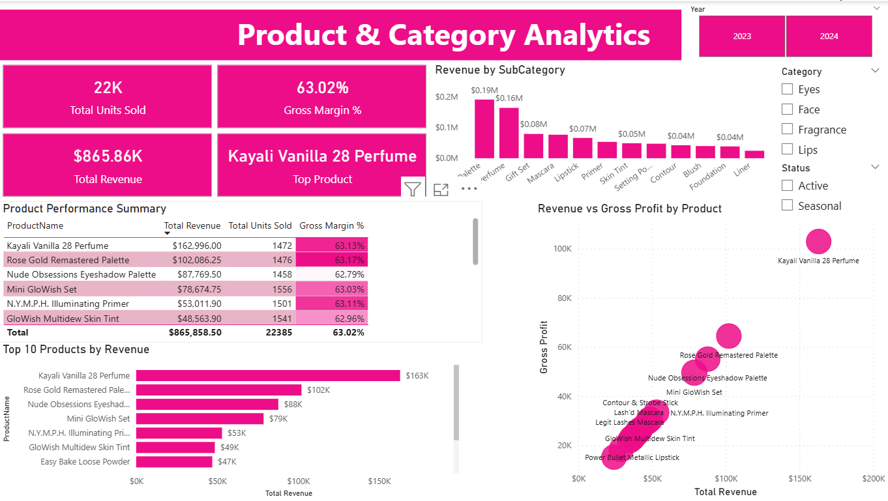
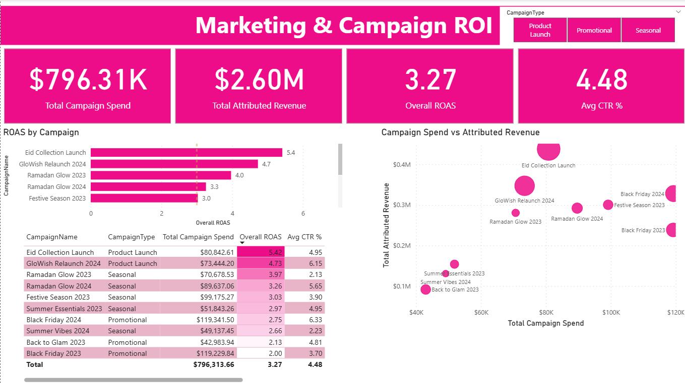
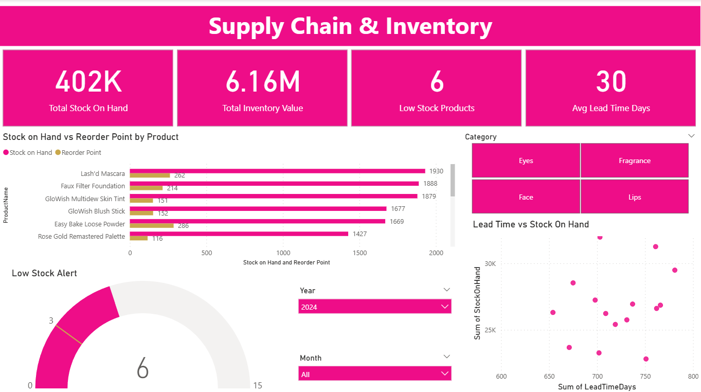

# Huda Beauty – Multi-Domain Power BI Analytics Dashboard

## Overview

This project is an end-to-end multi-domain Power BI analytics dashboard developed to simulate a real-world UAE beauty retail environment inspired by Huda Beauty — one of the world's fastest-growing beauty brands headquartered in Dubai.

The dashboard covers four key business domains — eCommerce Sales, Product Analytics, Marketing ROI, and Supply Chain — and translates synthetic retail data into actionable business insights across five interactive report pages.

> **Note:** The dataset used in this project is synthetically generated using Python to simulate realistic UAE beauty retail patterns, including Ramadan and Black Friday seasonality. All data modelling, DAX development, and analytical work is original.

---

## Project Objectives

- Build a scalable star schema data model in Power BI using multiple fact and dimension tables
- Develop advanced DAX measures including time intelligence, dynamic ranking, and ratio calculations
- Design executive-ready dashboards tailored to different business stakeholders
- Simulate real-world UAE beauty retail dynamics including seasonal peaks and channel mix
- Demonstrate end-to-end analytics skills from data preparation to business storytelling

---

## Dashboard Pages

### Page 1 – Executive Overview
A senior leadership snapshot showing total revenue, gross margin, YoY growth, and monthly revenue trends across 2023 and 2024.

### Page 2 – eCommerce & Sales Performance
Deep-dive into channel performance across 8 UAE sales channels, product-channel revenue heatmap, and monthly revenue vs promotional discount analysis.

### Page 3 – Product & Category Analytics
Product performance summary, top 10 revenue drivers, revenue by sub-category, and a scatter plot revealing revenue vs gross profit relationships by SKU.

### Page 4 – Marketing & Campaign ROI
Campaign efficiency analysis across 10 campaigns with ROAS benchmarking, spend vs attributed revenue scatter, and full campaign performance summary table.

### Page 5 – Supply Chain & Inventory
Inventory health monitoring including stock vs reorder point analysis, monthly stock heatmap, low stock gauge alert, and lead time risk quadrant.

---

## Key Insights

### Revenue & Growth
- Total revenue of $865.86K across 2023–2024 with a 0.77% YoY growth rate
- Ramadan (March–April) and Black Friday (November) together drive approximately 38% of annual revenue
- 77.88% of revenue is generated through eCommerce channels, confirming Huda Beauty's digital-first positioning

### Product Performance
- Kayali Vanilla 28 Perfume is the top revenue-generating SKU at $162,996 — a single fragrance product outperforming all makeup SKUs
- Palettes are the highest-revenue sub-category, driven by the Rose Gold Remastered and Nude Obsessions lines
- Gross margin is consistently ~63% across all product categories, indicating strong pricing discipline

### Marketing ROI
- Overall ROAS of 3.27x across all campaigns
- Product Launch campaigns (Eid Collection 5.42x, GloWish Relaunch 4.73x) significantly outperform Promotional campaigns (avg 2.3x)
- Black Friday requires the highest spend but delivers below-average ROAS, suggesting diminishing returns on discount-led marketing

### Supply Chain
- December 2024 snapshot shows healthy inventory levels with all SKUs above reorder thresholds
- Average lead time of 30 days across the product range
- 6 out of 15 products flagged as low stock based on reorder point thresholds

---

## Data Model

Star schema with one central fact table and four dimension tables:

```
FactSales (13,406 rows)
    → DimDate       (DateKey)
    → DimProduct    (ProductID)
    → DimChannel    (ChannelID)
    → DimCampaign   (CampaignID)

FactInventory (360 rows)
    → DimProduct    (ProductID)

FactCampaignPerformance (10 rows)
    → DimCampaign   (CampaignID)
```

---

## DAX Measures Developed

### Time Intelligence
- Revenue LY (SAMEPERIODLASTYEAR)
- Revenue YoY %
- Revenue MTD, YTD, YTD LY
- Revenue Rolling 3M (DATESINPERIOD)
- Hardcoded Revenue 2023 / Revenue 2024 for visual overlays

### Sales & Profitability
- Total Revenue, Total COGS, Gross Profit
- Gross Margin %, Avg Order Value, Avg Discount %
- eCommerce Revenue, eCommerce Revenue %

### Product Intelligence
- Product Revenue Rank (RANKX with DENSE)
- Top Product (FIRSTNONBLANK + TOPN)
- Is Top 5 Product flag

### Marketing
- Overall ROAS, Total Campaign Spend, Total Attributed Revenue
- Avg CTR %, Budget Utilisation %

### Inventory
- Total Stock On Hand, Total Inventory Value
- Low Stock Products (conditional COUNTROWS)
- Avg Lead Time Days

---

## Tools & Technologies Used

- Microsoft Power BI Desktop (DAX, Power Query, Star Schema)
- Python (synthetic data generation using random, csv, datetime libraries)
- Microsoft Excel (data validation)

---

## Skills Demonstrated

- Star Schema Data Modelling
- Advanced DAX (time intelligence, iterators, filter context)
- Power Query data transformation
- Dashboard UX design and layout
- Business storytelling across multiple stakeholder domains
- UAE beauty retail domain knowledge
- KPI design and executive reporting

---

## Dataset

The dataset is synthetically generated using Python and consists of 7 CSV files:

| File | Rows | Description |
|------|------|-------------|
| FactSales.csv | 13,406 | Order-level transactions Jan 2023 – Dec 2024 |
| FactInventory.csv | 360 | Monthly stock data per product |
| FactCampaignPerformance.csv | 10 | Campaign KPIs (impressions, clicks, ROAS) |
| DimDate.csv | 731 | Full calendar table with time intelligence support |
| DimProduct.csv | 15 | Huda Beauty product catalogue with LaunchYear |
| DimChannel.csv | 8 | UAE sales channels (eCommerce + Retail) |
| DimCampaign.csv | 10 | Marketing campaigns 2023–2024 |

Seasonality is modelled to reflect real UAE beauty retail patterns — Ramadan peaks in March/April, Black Friday in November, and summer dips in June/July.

---

## Dashboard Preview

### Executive Overview


### eCommerce & Sales Performance


### Product & Category Analytics


### Marketing & Campaign ROI


### Supply Chain & Inventory


---

## Project Files

- `huda-beauty-dashboard.pbix` — Power BI report file
- `data/` — All 7 CSV source files
- `visuals/` — Dashboard page screenshots
- `README.md` — Project documentation

---

## Conclusion

This project demonstrates the ability to design and deliver a multi-domain Power BI analytics solution from scratch — covering data modelling, DAX development, dashboard design, and business insight generation across Finance, eCommerce, Marketing, and Supply Chain functions.

The dashboard is designed to reflect the kind of analytical output expected in a senior BI role within a UAE-based beauty retail organisation, with particular attention to UAE market dynamics such as Ramadan seasonality, digital channel dominance, and premium product positioning.
